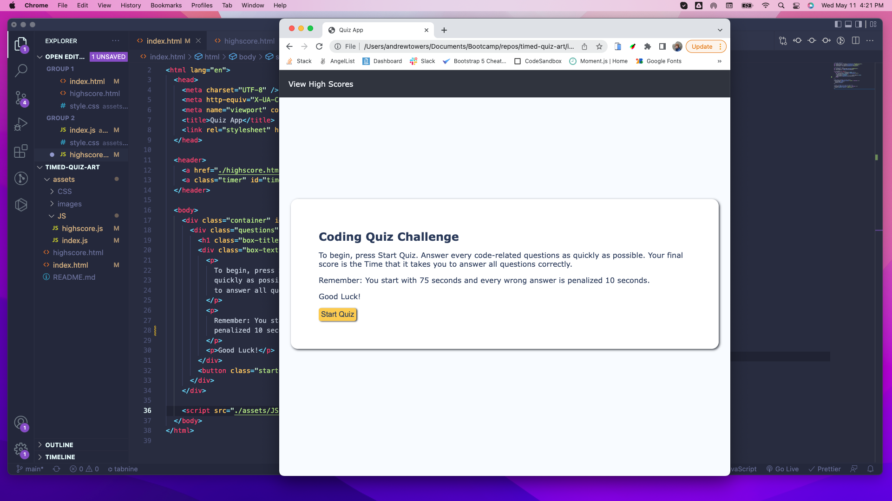
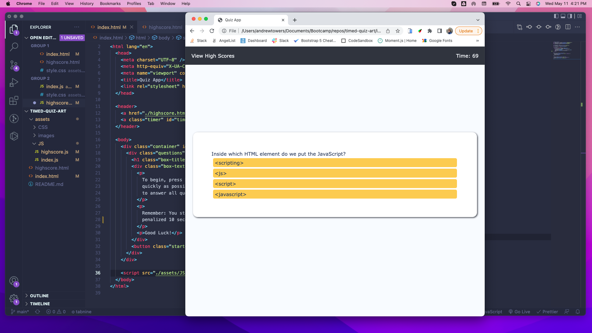

GitHub URL: https://glo6al.github.io/timed-quiz-art/
Repository URL: https://github.com/glo6al/timed-quiz-art.git

I started by declaring variables that were later called in the various functions used to run the app. These variables hold the information for the timer, questions, and answers. I then created a function for the timer that begins a countdown once the start button was clicked.

As the countdown timer begins, another function loops the 5 questions. A for loop performs this function and cycles through each question until all questions are answered. I wrote a function globally scope that checks if an answer is correct or not. If the answer is correct, it presents the next question. If incorrect, it subtracts 10 seconds from the users time.

One of the last functions I wrote was to store the users name and time into local storage. This allows another javascript file to retrieve user initials and score and present it on a leaderboard in a separate file.

An event listener is used to listen for and submit a form that captures user data.

The index.html file is the main page for the time quiz. This is where all of the questions and answers are displayed, as well as the start button and timer. The code for this page is written in index.html.

In this screenshot, you can see the a still shot of for loop that I used to cycle through the questions. The questions are shown above the possible answers, and as they are answered, they present the next question. This allows users to only see one question at a time.

In this screenshot, you can see the input field where users will enter their initials and score. The form is submitted when the user clicks on the submit button. This will then send the user data to a separate javascript file to be retrieved (shown in screenshot below).

As shown in this screenshot, after the clicks submit the users initials and scores are shown on the leaderboard. The data is retrieved using getItem and is parsed to display as string. The clear button empties the leaderboard by using the clear function, while the restart button reloads the index page to start the quiz over.
